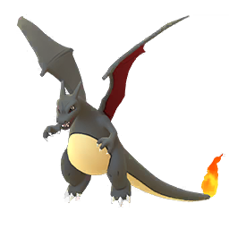
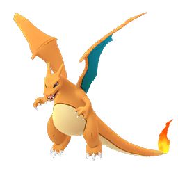

<h1 style="font-weight:normal"> 
  How different are shiny Pokemon? 
</h1>

[]() [](https://github.com/wjsutton/pogo_shiny_colour_difference/issues) [](https://github.com/wjsutton/pogo_shiny_colour_difference/pulls) [](/LICENSE)

A dataviz project looking at the differences in colour between shiny pokemon & non-shiny pokemon in the mobile game Pokemon Go.

Data Sources
 - Images forked from github repo [ZeChrales/PogoAssets](https://github.com/ZeChrales/PogoAssets)
 - Additional images available from [PokeMiners/pogo_assets](https://github.com/PokeMiners/pogo_assets)
 - Pokemon Metadata from [Kaggle Dataset](https://www.kaggle.com/rounakbanik/pokemon)

[Twitter][Twitter] :speech_balloon:&nbsp;&nbsp;&nbsp;|&nbsp;&nbsp;&nbsp;[LinkedIn][LinkedIn] :necktie:&nbsp;&nbsp;&nbsp;|&nbsp;&nbsp;&nbsp;[GitHub :octocat:][GitHub]&nbsp;&nbsp;&nbsp;|&nbsp;&nbsp;&nbsp;[Website][Website] :link:

<!--/div-->

<!--
Quick Link 
-->

[Twitter]:https://twitter.com/WJSutton12
[LinkedIn]:https://www.linkedin.com/in/will-sutton-14711627/
[GitHub]:https://github.com/wjsutton
[Website]:https://wjsutton.github.io/

### :a: About

Pokemon Go is a mobile game about capturing and battling virtual creatures called Pokemon. A shiny Pokemon is like any other Pokemon except it is a different colour than its non-shiny version, and much rarer to find on average the chances of finding a shiny Pokemon is 1 in 450 (with some exceptions around events like community days).

However, some shiny Pokemon look very similar to their non-shiny versions. I was fortunate to catch a shiny Pikachu but could hardly notice the difference to the regular non-shiny Pikachu.

A Shiny Pikachu | A Non-shiny Pikachu
:-------------------------:|:-------------------------:|
 | 

For other Pokemon, the colour difference is much more obvious.

A Shiny Charizard | A Non-shiny Charizard
:-------------------------:|:-------------------------:|
 | 

And hence the motivation for this project, can we determine which Pokemon differ the most (or least) from their shiny versions.

### Method 

- Simplifying the Pokemon colours using K-means clusters
- Calculating the difference colour

### Simplifying the Pokemon colours using K-means clusters

- read images
- remove white background
- run clustering
- determine which cluster is the best


### Calculating the difference colour

For calculating the colour difference we only require the average colour of the pokemon icon, for which we can use the example of clustering with kmeans on k = 1. Taking the red, green and blue (RGB) colour values of the Pokemon's average colour we calculate the Euclidean distance between RGB of the regular Pokemon and the shiny version. e.g.

```
comparison$distance <- sqrt(
  (comparison$red.x - comparison$red.y)^2
  + (comparison$green.x - comparison$green.y)^2
  + (comparison$blue.x - comparison$blue.y)^2
)
```
The value returned is the distance between these two points if they where plots of a 3-dimensional axis. The numbers can be compared against one another where a large number indicates the points are further away and that the difference in colour is greater.

### Data Visualisation

See the viz on Tableau Public:<br>
<a href="https://public.tableau.com/profile/wjsutton#!/vizhome/ShinyPokemon/ShinyPokemonHowmuchdoestheircolourchange">

</a>

### Bonus

Using the data from the pokemon colour clusters I've established an instagram account for Pokemon colour palettes

See the colour palettes on Instagram:<br>
<a href="https://www.instagram.com/poke_palettes/">

</a>
